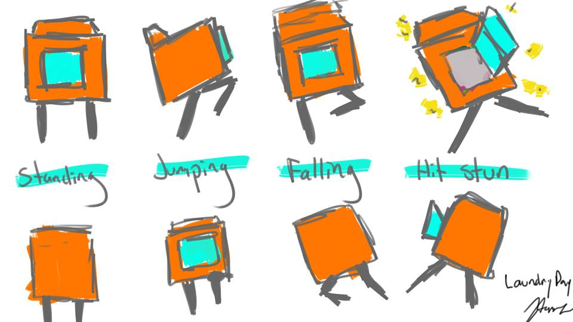
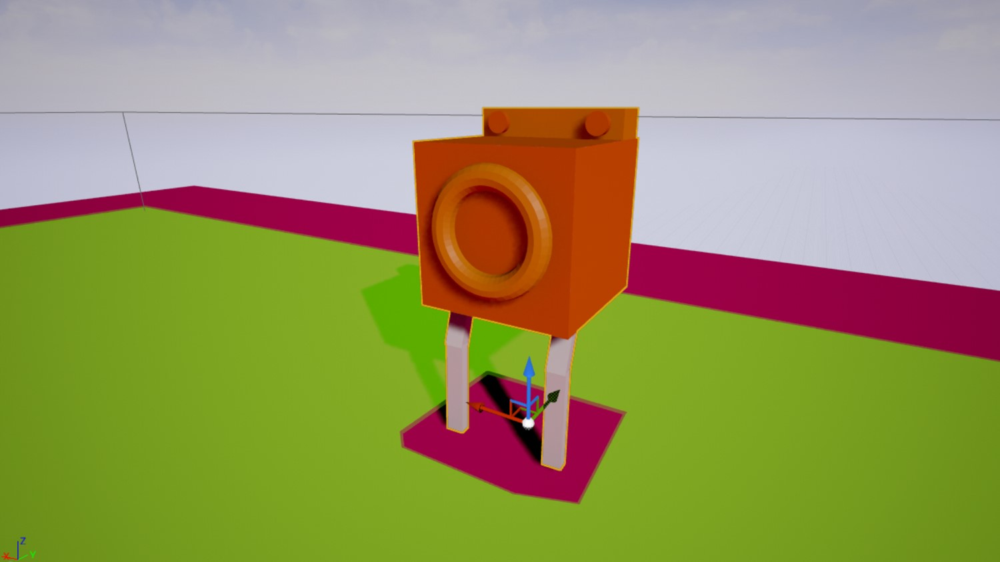
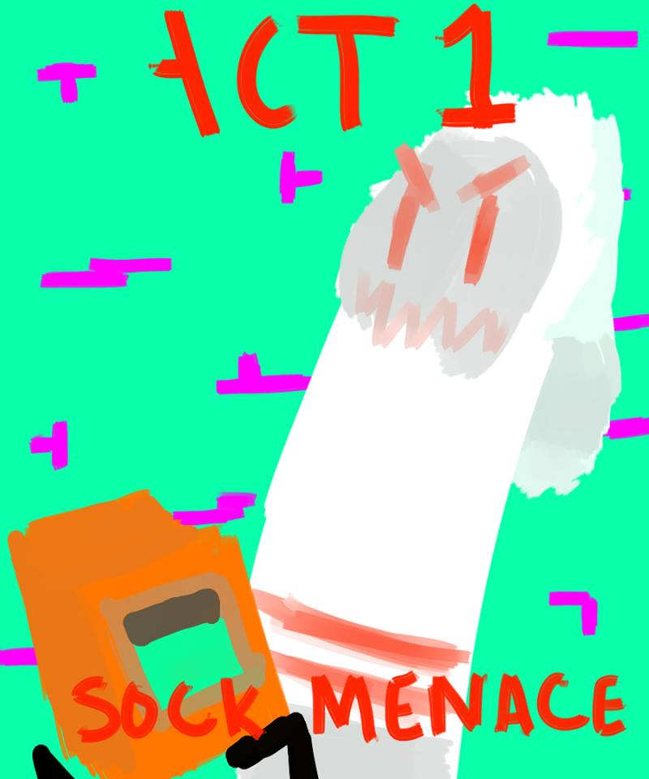
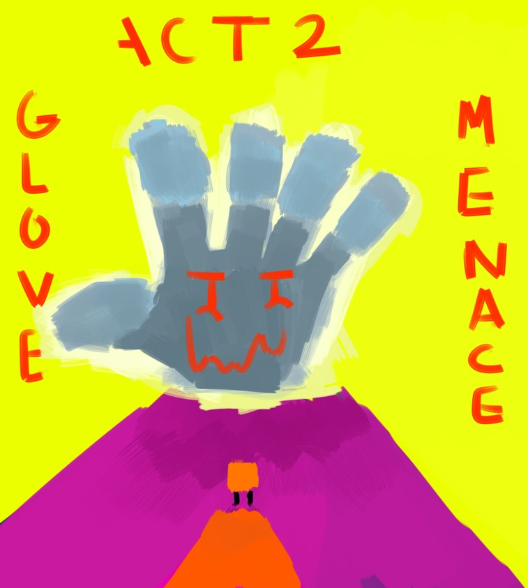

# Laundry Day README

Contributors: Michael Kimball, Jorge Torres, Alex Jackson, Josh Alleman

## General Info
### Synopsis
Laundry day is a video game developed in the FSU Game Design Class. It is a third person platformer with a turn-based combat system. It is being developed currently using Unreal Engine ver. 4.

### Game Story
A lazy scientist hates doing his laundry. It’s nothing but time consuming and he’d rather be doing science stuff, so he comes up with a solution. The scientist makes a chip that allows inanimate objects to come to life, and he installs the chip onto his washing machine in order for it to do the laundry for him. This goes as he plans until an evil villain takes the technology that brought our hero, Washy the washer, to life and uses it for his own evil doings, bringing squads of dirty laundry goons to life, terrorizing the city.

### Concept Art

Laundry Day Concept Logo

Laundry Day Hero Concept Art

Laundry Day "Washy" Model

Laundry Day Act 1 Level Concept

Laundry Day Act 2 Level Concept
